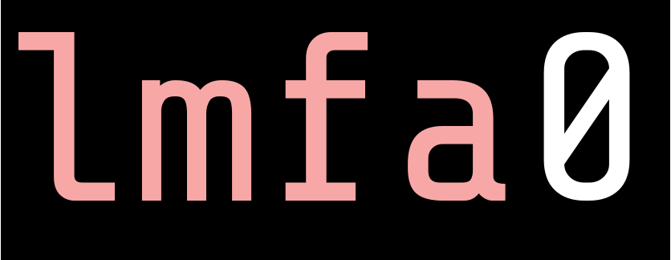

> Only CI when you must

For documentation including use cases, installation and usage instructions, see the official project page at [https://bff.gitlab.io/lmfa0/](https://bff.gitlab.io/lmfa0/)

**Warning: 0% test coverage today. Because 0 tests today. It works on my machine**

## Building From Source

Currently requires building using `cargo`:

```
cargo install --git https://gitlab.com/bff/lmfa0.git
```

**Optional**: Use `strip` to further shrink the binary size a up to 100kb (roughly 850kb without this as of 3/17/2020).

```
$ strip "$(which lmfa0)"
```

## Contributions Welcome

If you're interested in this project, feel free to open an issue and propose your idea.

### Particular Contributions of Interest

 * Cucmber tests
 * Unit tests
 * Code coverage
 * Config options for:
   * Making `root` into a glob to only consider file suffixes
   * Configuring repo location
   * A way to build a DAG by composing rules together (similar to Make)
 * Posting to Reddit
 * Blogging about this project!
 * Contriving a meaning for this an acronym?

## License

Distributed under an Apache 2.0 license. See LICENSE.txt for full license.
